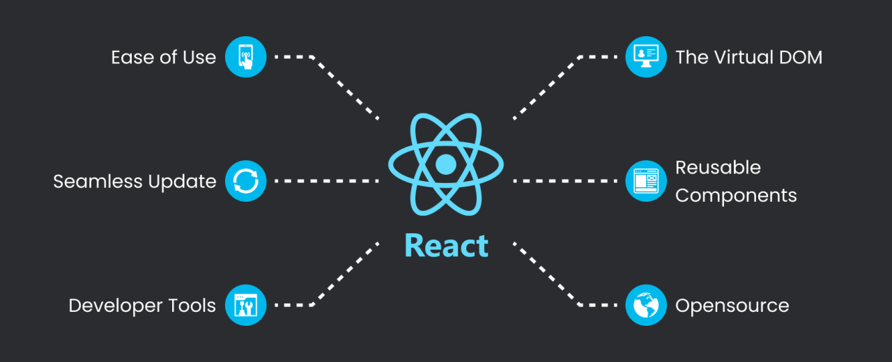
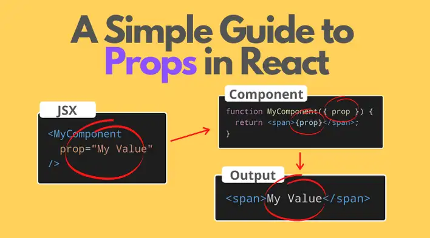
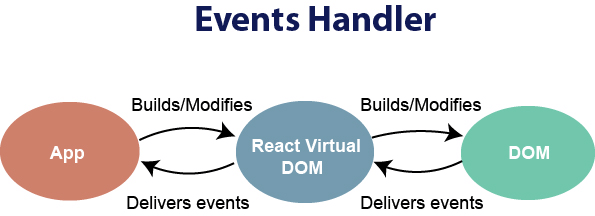
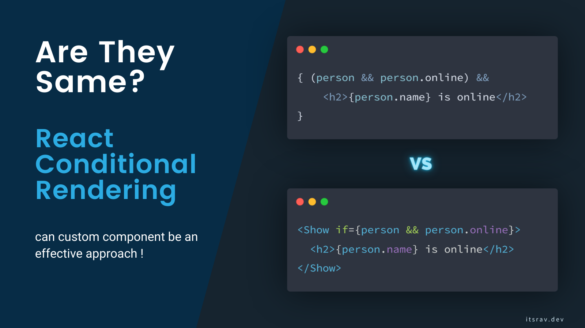
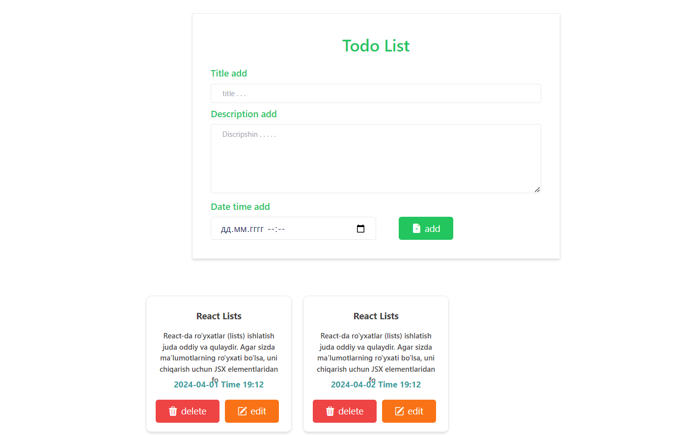
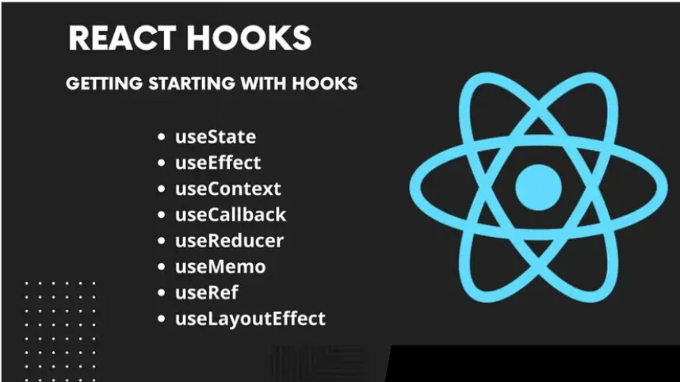

#      ReactJS 



- **React.js** *foydalanuvchi interfeyslarini yaratish uchun mashhur JavaScript kutubxonasidir. 2011-yilda Facebook tomonidan ishlab chiqilgan React.js dasturchilarga qayta foydalanish mumkin bo‘lgan UI komponentlarini yaratish va o‘z ilovalari holatini samarali va tushunarli tarzda boshqarish imkonini beradi.*


- **React.js** *ning asosiy afzalliklaridan biri ma'lumotlar o'zgarishi asosida foydalanuvchi interfeysini samarali yangilash qobiliyatidir. React butun sahifani qayta ko‘rsatish o‘rniga, foydalanuvchi interfeysining faqat kerakli qismlarini yangilash uchun virtual DOM (Hujjat obyekti modeli) dan foydalanadi, bu esa unumdorlikni oshirishi va umumiy foydalanuvchi tajribasini tezlashtirishi mumkin*

<hr>

### React Components


- **ReactJS-da** *komponentlar, interfeysning tuzilishi uchun qo'llaniladigan modullar hisoblanadi. Har bir komponent, o'zining xususiyati va vazifalari bo'lgan bir elementni aks ettiradi. Misol uchun, sahifa sarlavhasi, navigatsiya paneli, ma'lumotlar ro'yxati yoki odam profili komponentlar bo'lishi mumkin.* 

React komponentlar JSX (JavaScript XML) sintaksisida yaratiladi. JSX sintaksi React elementlari yaratish uchun mo'ljallangan va u HTML-ga o'xshashdir, ammo JavaScriptga ham o'xshashdir. JSX orqali, komponentlarni bir-biriga qo'shish, saqlash, va ularni boshqarish mumkin bo'ladi.

Quyidagi misol, oddiy bir "HelloWorld" komponentni yaratishni ko'rsatadi:
```
import React from 'react';

// HelloWorld komponenti
function HelloWorld() {
  return <h1>Hello, World!</h1>;
}

// Komponentni sahifaga chiqarish
ReactDOM.render(
  <HelloWorld />,
  document.getElementById('root')
);
```

- **Komponentlar quyidagi asosiy xususiyatlarga ega:**

1. **Props:** Boshqa komponentlar tomonidan ma'lumot olish uchun uzatiladigan argumentlar.
2. **State:** Komponentning vaziyati, o'zgaruvchanlari.
3. **Lifecycle Methods:** Komponent hayot tsiklining turli bosqichlari (yaratish, yangilanish, o'chirish).
4. **Event Handling:** Foydalanuvchi hodisalariga javob berish uchun funksiyalar.
5. **Nested Components:** Komponentlar ichida boshqa komponentlarni o'z ichiga oladi.
6. **Context:** Ma'lumotlarni komponentlar orasida almashish.

- **Komponentlar**, *React dasturlashining qulayliklaridan biridir, chunki ular kodni qisqa va tuzilgan bo'lishini ta'minlaydi. Masofaviy komponentlar bo'yicha bo'limlar, kutubxonalar va jamoalar kengaymoqda, shuning uchun React komponentlarini tushunish va ular bilan ishlash, bir dastur yaratishda keng qo'llaniladigan bir qo'llanma hisoblanadi.*


<hr>

### React Props 

  

- **ReactJS-da** *"props" (properties) komponentlarga ma'lumot uzatish uchun ishlatiladi. Props lar, bir komponentdan boshqasiga ma'lumot uzatish orqali, komponentlarning birligini o'zaro aloqador va birlashgan qilishga yordam beradi.*

- *Bularni yana biror funksiya yoki obyekt sifatida o'xshatish mumkin. Biroq, ular boshqa komponentlarga o'zgartirilmas o'zgaruvchilar sifatida uzatilishi mumkin emas, ya'ni ularni o'zgartirib bo'lmaydi.*


Biror komponentda props ni qabul qilish uchun funksiya ichida parametrlar sifatida qabul qilinadi. <br>
Misol uchun:

```
function Welcome(props) {
  return <h1>Salom, {props.name}</h1>;
}
```
Bu yerda 'Welcome' nomli komponent 'name' nomli prop sifatida 'props' obyektini qabul qiladi.

Komponentni ishlatish:

```
<Welcome name="John" />
```

Bu yerdagi name prop'ni "John" qiymati bilan uzatadi. Shuningdek, biror son, matn, yoki boshqa JavaScript obyekti ham bo'lishi mumkin:

```
<Welcome name={user.name} />
```

Bu usul bilan, qanday qilib React komponentlarida ma'lumotlar o'zgaruvchan va dinamik qilib yaratish mumkin. props, bir komponentdan boshqasiga ma'lumot uzatish uchun keng foydalaniladigan vosita hisoblanadi va React-ni o'rganishda juda muhim qismni tashkil etadi.

- Kengroq korishlik uchun misol 

```
function Car(props) {
  return <h2>I am a { props.brand }!</h2>;
}

function Garage() {
  const carName = "Ford";
  return (
    <>
      <h1>Who lives in my garage?</h1>
      <Car brand={ carName } />
    </>
  );
}

const root = ReactDOM.createRoot(document.getElementById('root'));
root.render(<Garage />);
```

<hr>

### React Events



- **ReactJS-da** *hodisalar (events) DOM elementlari bilan ishlashga o'xshash ravishda ishlaydi, lekin ular React komponentlariga bog'liqdir. React hodisalar, DOM elementlarida hodisalarning ishlashiga o'xshash shaklda ishlash uchun qo'llaniladi, ammo ular React komponentlari uchun amal qiladi.*

Quyidagi hodisalar ReactJS-da keng qo'llaniladi:

1. **onClick:** Foydalanuvchi elementga bosganda hodisaning amalga oshirilishi uchun ishlatiladi.

Masalan:
```
function handleClick() {
  console.log('Button bosildi');
}

<button onClick={handleClick}>Bosing</button>

```

2. **onChange:** Element qiymati o'zgartirilganda hodisaning amalga oshirilishi uchun ishlatiladi. Masalan, input maydonidagi matn o'zgartirilganda.

Masalan:

```
function handleChange(event) {
  console.log('Yangi qiymat: ', event.target.value);
}

<input type="text" onChange={handleChange} />

```
3. **onSubmit:** Formani jo'natganda hodisaning amalga oshirilishi uchun ishlatiladi.

Masalan:

```
function handleSubmit(event) {
  event.preventDefault();
  console.log('Forma jo\'natildi');
}

<form onSubmit={handleSubmit}>
  <button type="submit">Jo'natish</button>
</form>

```

4. **onMouseOver va onMouseOut:** Elementga kursor qo'yganda yoki undan chiqib ketganda hodisaning amalga oshirilishi uchun ishlatiladi.

Masalan:

```
function handleMouseOver() {
  console.log('Elementga kursor qo\'yildi');
}

function handleMouseOut() {
  console.log('Elementdan kursor chiqib ketdi');
}

<div onMouseOver={handleMouseOver} onMouseOut={handleMouseOut}>Element</div>

```
<hr>

### React Conditional Rendering



- **React-da** *shartli rendeirlash (conditional rendering), shartlar bo'yicha biror JSX elementini ekranga chiqarish imkoniyatini beradi. Bu, belgilangan shartning qanoatlantirilishi bilan bog'liq, shu sharti qanoatlantirilganda belgilangan JSX elementi ekranga chiqariladi, aks holda esa boshqa JSX elementi ekranga chiqariladi yoki hech narsa chiqmagan bo'ladi.*

Quyidagi misol shartli rendeirlashga misol bo'lib ko'rinadi:

```
function Greeting(props) {
  const isLoggedIn = props.isLoggedIn;
  if (isLoggedIn) {
    return <UserGreeting />;
  }
  return <GuestGreeting />;
}

function UserGreeting() {
  return <h1>Salom, do'stim!</h1>;
}

function GuestGreeting() {
  return <h1>Ro'yxatdan o'ting, iltimos.</h1>;
}

ReactDOM.render(
  <Greeting isLoggedIn={true} />,
  document.getElementById('root')
);

```
Ushbu kodda, Greeting nomli komponent isLoggedIn nomli prop orqali kirish holatini olishadi. Agar foydalanuvchi kira holatida bo'lsa, UserGreeting nomli komponentni chiqaradi, aks holda esa GuestGreeting nomli komponentni chiqaradi.

Bunda, JSX elementlari ham shartli bo'lishi mumkin. Misol uchun:

```
function Greeting(props) {
  const isLoggedIn = props.isLoggedIn;
  return (
    <div>
      {isLoggedIn ? (
        <UserGreeting />
      ) : (
        <GuestGreeting />
      )}
    </div>
  );
}

```

Bu usul ham shartli rendeirlashda foydalanish uchun osonroq bo'lishini ta'minlaydi.
<hr>

### React Lists



- **React-da** *ro'yxatlar (lists) ishlatish juda oddiy va qulaydir. Agar sizda ma'lumotlarning ro'yxati bo'lsa, uni chiqarish uchun JSX elementlaridan foydalanishingiz mumkin. Misol uchun, agar sizda ismlar ro'yxati bo'lsa, uni quyidagicha chiqarishingiz mumkin:*

```
const names = ['John', 'Doe', 'Jane'];

function NameList() {
  return (
    <ul>
      {names.map((name, index) => (
        <li key={index}>{name}</li>
      ))}
    </ul>
  );
}

ReactDOM.render(
  <NameList />,
  document.getElementById('root')
);

```

<hr>

### React hooks



-  **ReactJS-dagi** *hook deb nomlanuvchi funksiyalar funktsional komponentlarga classlar yaratmasdan turib holat va boshqa React xususiyatlaridan foydalanish imkonini beradi. React 16.8 ga birinchi bo'lib kiritilgan hooklar ishlab chiquvchilarga komponentlar o'rtasida statistik xatti-harakatlardan qayta foydalanishga imkon beradi. Ilgari, bu class komponentlari va yuqori darajadagi komponentlar (HOC) bilan cheklangan edi.*

### ReactJS da hooklarnig turlari 

- **useState:** Komponentning holatini saqlash va o'zgartirish uchun ishlatiladi.
- **useEffect:** Komponentni yaratilganida, yangilanishida yoki o'chirilganida avtomatik amallar bajarish uchun ishlatiladi.
- **useContext:** Context API ni o'rganish va undan foydalanish uchun ishlatiladi.
- **useReducer:** Tilni tuzilgan bo'lib, xatolarni kamaytirish uchun ishlatiladi.
- **useCallback:** Kengaytirilgan funksiya o'zgaruvchilarini saqlash va qayta ishlatish uchun ishlatiladi.
- **useMemo:** Qiymatni keshlash uchun ishlatiladi.
- **useRef:** DOM elementlari bilan ishlash uchun ishlatiladi.
- **useLayoutEffect:** useEffect bilan o'xshash, lekin brauzer DOM ochilishidan avval amalni bajaradi.